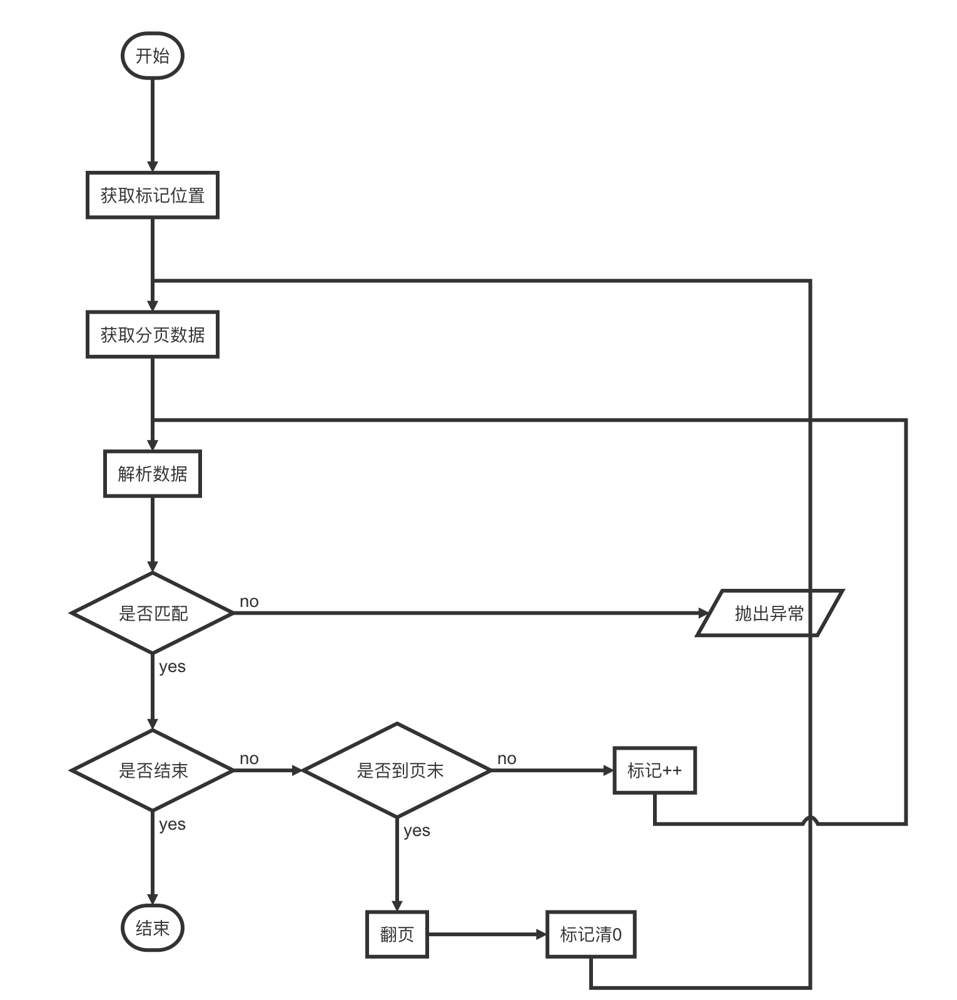

# node_reptile
一个node的爬虫程序

```
.
├── README.md
├── data.json	// 持久化数据
├── index.js	// node脚本
├── list.json	// 输出打印数据
└── package.json
```

### 主流程

主要职能：

- 循环抓取数据
- 进度初始化读取、自动保存
- 异常处理
- 人工干预校准匹配算法
- 打印输出结果


### 爬虫流程

> 处理业务

主要职能：

- 防止网络波动，自动重试，封装请求函数
- 数据按页爬取，分页保存，二维数组
- 校验匹配结果准确性



