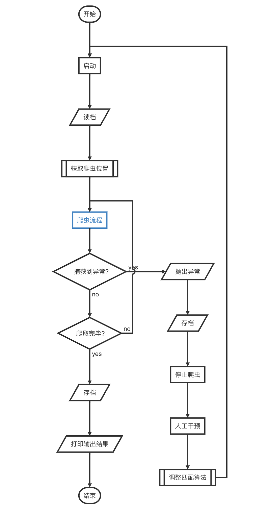

# node_reptile
这里只用了[cheerio](https://github.com/cheeriojs/cheerio)，我是想把爬虫的一般流程抽象出来，以满足更多业务场景的需求。

### 适用场景

静态网页

### 特色功能

自动重试、自动存档、人工干预校准

### 快速启动

```shell
npm install
node index.js
```

### 目录介绍

```
.
├── README.md
├── data.json	// 存档分页数据 二维数组[pageIndex, dataIndex]
├── index.js	// node脚本
├── list.json	// 输出打印数据
└── package.json
```

### 主流程

主要职能：

- 循环抓取数据
- 进度初始化读取、自动保存
- 异常处理
- 人工干预校准
- 打印输出结果

```flow
st=>start: 开始
e=>end: 结束
open=>operation: 启动
read=>inputoutput: 读档
lo=>subroutine: 获取爬虫位置
crawl=>operation: 爬虫流程:>#爬虫流程
search=>condition: 捕获到异常?
throw=>inputoutput: 抛出异常
save=>inputoutput: 存档
pause=>operation: 停止爬虫
adjust=>operation: 人工干预
change=>subroutine: 调整匹配算法
isover=>condition: 爬取完毕?
print=>inputoutput: 打印输出结果
save2=>inputoutput: 存档

st->open->read->lo->crawl->search
search(no)->isover
isover(yes)->save2->print->e
isover(no)->crawl
search(yes, right)->throw(bottom)->save(bottom)->pause(bottom)->adjust(bottom)->change(right)->open

```



### 爬虫流程

> 处理业务

主要职能：

- 防止网络波动，自动重试，封装请求函数
- 数据分页爬取，使用二维数组存储
- 校验匹配结果准确性

```flow
s=>start: 开始
o=>operation: 爬虫
e=>end: 结束
page=>operation: 获取分页数据
start=>operation: 获取标记位置
ismacth=>condition: 是否匹配
isover=>condition: 是否结束
ispageover=>condition: 是否到页末
next=>operation: 翻页
zero=>operation: 标记清0
exception=>inputoutput: 抛出异常
resolve=>operation: 解析数据
plus=>operation: 标记++

s->start->page->resolve->ismacth
ismacth(yes)->isover
isover(yes)->e
isover(no)->ispageover
ispageover(yes)->next(right)->zero->page
ispageover(no)->plus->resolve
ismacth(no)->exception
```


### 可能遇到的问题

#### node版本号问题

尽量用`node`高版本，低版本对`es6`语法支持不是很好。

我用的`vscode`，本地装了`nvm`，`debug`的时候会出现`node`版本号不对的情况，即使是切换了版本号也不行。

##### 解决办法

1. 切换`nvm`默认版本号`nvm alias default 8.11.1`，因为`vscode`执行终端使用的是默认版本。
2. 添加 `runtimeExecutable` 到你的 `.vscode/launch.json` 

```json
{
    "version": "0.2.0",
    "configurations": [
        
        {
            "type": "node",
            "request": "launch",
            "name": "启动程序",
            "program": "${workspaceFolder}/index.js",
            "runtimeExecutable": "${env:HOME}/.nvm/versions/node/v8.11.1/bin/node" 
        }
    ]
}
```

### 心得体会

#### 程序设计，先有鸡还是先有蛋？

很多人觉得要先把流程设计出来，再写代码。

其实我经常这样的，先撸，遇到问题再作调整，最后再把所有流程串起来。

1. 出发点是理想状况，实施过程中肯定还会遇到很多问题，边做边调整会更好
2. 经验不丰富，行动比想象更有效

#### 用python会更好一些

一是框架更成熟，支持也更广泛；二是语法更适合