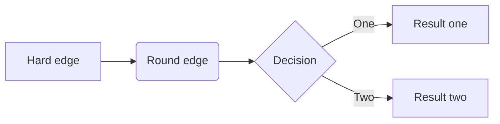

# node_reptile
一个node的爬虫程序

```
.
├── README.md
├── data.json	// 持久化数据
├── index.js	// node脚本
├── list.json	// 输出打印数据
└── package.json
```

### 主流程

主要职能：

- 循环抓取数据
- 进度初始化读取、自动保存
- 异常处理
- 人工干预校准匹配算法
- 打印输出结果

```flow
st=>start: 开始
e=>end: 结束
open=>operation: 启动
read=>inputoutput: 读档
lo=>subroutine: 获取爬虫位置
crawl=>operation: 爬虫流程:>#爬虫流程
search=>condition: 捕获到异常?
throw=>inputoutput: 抛出异常
save=>inputoutput: 存档
pause=>operation: 停止爬虫
adjust=>operation: 人工干预
change=>subroutine: 调整匹配算法
isover=>condition: 爬取完毕?
print=>inputoutput: 打印输出结果
save2=>inputoutput: 存档

st->open->read->lo->crawl->search
search(no)->isover
isover(yes)->save2->print->e
isover(no)->crawl
search(yes, right)->throw(bottom)->save(bottom)->pause(bottom)->adjust(bottom)->change(right)->open

```


### 爬虫流程

> 处理业务

主要职能：

- 防止网络波动，自动重试，封装请求函数
- 数据按页爬取，分页保存，二维数组
- 校验匹配结果准确性

```flow
s=>start: 开始
o=>operation: 爬虫
e=>end: 结束
page=>operation: 获取分页数据
start=>operation: 获取标记位置
ismacth=>condition: 是否匹配
isover=>condition: 是否结束
ispageover=>condition: 是否到页末
next=>operation: 翻页
zero=>operation: 标记清0
exception=>inputoutput: 抛出异常
resolve=>operation: 解析数据
plus=>operation: 标记++

s->start->page->resolve->ismacth
ismacth(yes)->isover
isover(yes)->e
isover(no)->ispageover
ispageover(yes)->next(right)->zero->page
ispageover(no)->plus->resolve
ismacth(no)->exception
```


### 测试



